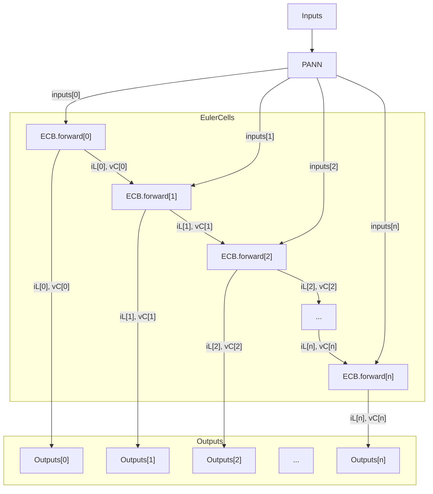

# 物理内包型ニューラルネットワーク（PANN）を用いた Buck Converter のシミュレーション解析

## 1. はじめに

本資料は、[Physics-integrated and Physically Explainable Artificial Neural Networks: A Structured Perspective for Solving Complex Nonlinear Inverse Problems](https://github.com/XinzeLee/PANN)で提案された物理内包型ニューラルネットワーク（Physics-Aware Neural Network: PANN）を用いて、降圧コンバータ（Buck Converter）の動作をシミュレーションする手法について説明します。

解析対象：`/notebooks/Buck-inference.ipynb`（本資料では`/my_notebooks/my_Buck-inference.ipynb`として日本語化・統合版を使用）

## 2. Buck Converter の理論的背景

### 2.1 Buck Converter の基本原理

降圧コンバータ（Buck Converter）は、スイッチモード電源の一種で、入力電圧 $V_{in}$ を目標電圧 $V_{ref}$ まで効率的に降圧する回路です。

#### 回路構成


主要構成要素：

- **スイッチ（MOSFET）**: デューティ比 $D$ で高速スイッチング
- **インダクタ $L$**: エネルギー蓄積・放出素子
- **ダイオード**: 電流の逆流防止（フリーホイーリングダイオード）
- **コンデンサ $C$**: 出力電圧の平滑化
- **負荷抵抗 $R_o$**: 電力消費素子

### 2.2 動作モードと状態方程式

Buck Converter には 2 つの動作モードが存在します：

#### Mode 1: スイッチ ON 時（$0 < t < DT_s$）

状態方程式：

$$
\begin{aligned}
L\frac{di_L}{dt} &= V_{in} - v_o \\
C\frac{dv_C}{dt} &= i_L - \frac{v_o}{R_o}
\end{aligned}
$$

#### Mode 2: スイッチ OFF 時（$DT_s < t < T_s$）

状態方程式：

$$
\begin{aligned}
L\frac{di_L}{dt} &= -v_o \\
C\frac{dv_C}{dt} &= i_L - \frac{v_o}{R_o}
\end{aligned}
$$

### 2.3 定常状態での関係式

定常状態では、インダクタ電流とコンデンサ電圧の 1 周期平均変化は 0 となるため：

$$V_o = D \cdot V_{in}$$

ここで、$D = \frac{T_{on}}{T_s}$ はデューティ比です。

# 挙動説明

## セル 1

必要なライブラリのインポート

```python
# ライブラリ
from collections import deque
from matplotlib.animation import FuncAnimation
import matplotlib.font_manager as fm
import matplotlib.pyplot as plt
import numpy as np
from scipy import signal
import seaborn as sns
import torch
import torch.nn as nn

```

## セル 2

matplotlib で日本語を表示するための設定

```python
# 日本語フォント
font_path = "<フォントパス>"
font_prop = fm.FontProperties(fname=font_path)
plt.rcParams["font.family"] = font_prop.get_name()
plt.rcParams["axes.unicode_minus"] = False
```

## セル 3: シミュレーションパラメータの設定

### 3.1 回路パラメータの定義

```python
# 変数定義
L, Co, Ro = 50e-6, 1000e-6, 3  # インダクタンス、出力コンデンサ容量、負荷抵抗
Ts = 1 / 20e3  # スイッチング周期（20 kHz）
Tslen = 100  # 1周期あたりの分割数
dt = Ts / Tslen  # シミュレーション刻み幅
Vin, Vref = 28, 6  # 入力電圧、基準電圧
D0 = Vref / Vin  # 平均デューティ比
Tsim = 200 * Ts  # シミュレーション全体時間

print(L, Co, Ro, Ts, Tslen, dt, Vin, Vref, D0, Tsim)
```

### 3.2 パラメータの物理的意味と設計考察

#### インダクタンス $L = 50\mu H$

- **役割**: 電流リップル $\Delta i_L$ の制限
- **設計式**: $\Delta i_L = \frac{V_{in} \cdot D(1-D)T_s}{L}$
- 本設定での電流リップル: $\Delta i_L \approx 1.67A$

#### 出力コンデンサ $C_o = 1000\mu F$

- **役割**: 出力電圧リップル $\Delta v_o$ の抑制
- **設計式**: $\Delta v_o = \frac{\Delta i_L}{8 f_s C_o}$
- 本設定での電圧リップル: $\Delta v_o \approx 10.4mV$

#### 負荷抵抗 $R_o = 3\Omega$

- **出力電流**: $I_o = \frac{V_{ref}}{R_o} = 2A$
- **出力電力**: $P_o = \frac{V_{ref}^2}{R_o} = 12W$

#### スイッチング周波数 $f_s = 20kHz$

- **選定理由**:
  - 可聴域上限付近（騒音低減）
  - スイッチング損失と受動部品サイズのトレードオフ

#### デューティ比 $D_0 = 0.214$

- **理論値**: $D_0 = \frac{V_{ref}}{V_{in}} = \frac{6}{28} \approx 0.214$
- **物理的意味**: スイッチが ON である時間の割合

## セル 4

入力電圧 vp の生成およびそのプロット

```python
def duty_cycle_mod(D0, Vin, dt, Tsim, Ts):
    """
    バックコンバータの変調戦略として
    デューティ比 D0 で方形波を生成し、負部分を 0 にクリップ。
    Vin をかけて端子電圧vpを作る。
    """
    t = np.linspace(0, Ts, round(Ts / dt), endpoint=False)
    s_pri = deque(signal.square(2 * np.pi / Ts * t, D0))
    vp = np.array(s_pri).clip(0, 1) * Vin
    vp = np.tile(vp, (round(Tsim / Ts),))
    return vp


vp = duty_cycle_mod(D0, Vin, dt, Tsim, Ts)
t = np.arange(0, len(vp) * dt, dt)

# 省略
```

## セル 5

vp の整形

```python
# PANN（後述）への入力は (バッチサイズ×シーケンス長×入力次元) の形式
inputs = vp[None, :, None]  # 1×T×1 の配列に変形
assert inputs.shape == (1, len(vp), 1)
inputs = torch.FloatTensor(inputs)  # Tensor 化
```

## セル 6: 物理内包型ニューラルネットワーク（PANN）による推論

### 4. PANN の理論的枠組み

#### 4.1 PANN の基本概念

物理内包型ニューラルネットワーク（PANN）は、物理法則を直接ネットワーク構造に組み込むアプローチです。従来のブラックボックス型ニューラルネットワークと異なり、PANN は：

1. **物理的解釈可能性**: 各層・各ニューロンが物理的意味を持つ
2. **保証された物理的整合性**: 物理法則（エネルギー保存則等）を満たす
3. **少ないデータでの学習**: 物理的事前知識により効率的な学習が可能

#### 4.2 PANN の数学的定式化

```python
class PANN(nn.Module):
    """
    物理内包型アーキテクチャニューラルネットワーク（PANN）
    - EulerCell_Buck: Buck コンバータのオイラー刻みセル
    - Recurrent 構造に物理モデルを組み込み
    """

    def __init__(self, cell, **kwargs):
        super(PANN, self).__init__(**kwargs)
        self.cell = cell

    def forward(self, inputs, x):
        outputs = []
        _x = x[:, 0]  # stateの初期化
        for t in range(inputs.shape[1]):
            state_next = self.cell.forward(inputs[:, t, :], _x)
            _x = state_next  # 予測された状態（state_next）を現在の状態として更新
            outputs.append(_x)  # 予測された状態をoutputsに追加
        return torch.stack(outputs, dim=1)

# 省略

buck_Euler_cell = EulerCell_Buck(dt, L, Co, Ro)
pann_buck = PANN(buck_Euler_cell)

# 省略
```

#### 4.3 PANN の時系列展開

PANN は再帰的ニューラルネットワーク（RNN）の構造を持ち、時刻$t$での状態$\mathbf{x}_t = [i_L(t), v_C(t)]^T$から次時刻の状態$\mathbf{x}_{t+1}$を予測します：

$$\mathbf{x}_{t+1} = f_{\text{cell}}(\mathbf{u}_t, \mathbf{x}_t)$$

ここで、$\mathbf{u}_t$は時刻$t$での入力（端子電圧$v_p$）、$f_{\text{cell}}$は物理法則を内包したセル関数です。

`pann_buck`は self.cell を buck_Euler_cell に設定した PANN のインスタンス

forward メソッドでは、self.cell.forward を繰り返し呼び出している。

つまり、EulerCell_Buck の forward メソッドに、入力波形 inputs のある時刻の値と、一つ前の時刻での EulerCell_Buck の forward メソッドの出力を渡している。



### 4.4 EulerCell_Buck の詳細な数学的定式化

EulerCell_Buck クラスは、Buck Converter の物理法則をオイラー法で離散化したセルです。

#### forward メソッドの数学的処理

```python
def forward(self, inputs, states):
    # inputs: [va] - 端子電圧 (s_pri * Vin)
    # states: [iL, vo] - 現在のインダクタ電流と出力電圧

    vo = states[:, 1]  # 出力電圧の抽出
    va = inputs[:, 0]  # 端子電圧の抽出

    # DCM条件の評価
    idx = (inputs[:, 0] == 0) & (states[:, 0] <= 0)
    va[idx] = vo[idx]  # DCM時の端子電圧補正

    # インダクタ電流の更新
    iL_next = states[:, 0] + self.dt / self.L * (va - vo)
    iL_next = torch.relu(iL_next)  # 電流の非負性を保証

    # コンデンサ電圧の更新
    vC_next = states[:, 1] + self.dt / self.Co * (states[:, 0] - vo / self.Ro)

    return torch.stack((iL_next, vC_next), dim=1)
```

#### 数学的解釈

1. **端子電圧 $v_a$ の決定**

   - 通常時: $v_a = \text{inputs}[:, 0] = s_{pri} \cdot V_{in}$
   - DCM 時（$v_a = 0$ かつ $i_L \leq 0$）: $v_a = v_o$（ダイオード導通）

2. **状態更新式**

   $$
   \begin{aligned}
   i_L[k+1] &= \max\left(0, i_L[k] + \frac{\Delta t}{L}(v_a[k] - v_o[k])\right) \\
   v_C[k+1] &= v_C[k] + \frac{\Delta t}{C_o}\left(i_L[k] - \frac{v_o[k]}{R_o}\right)
   \end{aligned}
   $$

3. **DCM 条件の物理的意味**
   - スイッチ OFF、かつインダクタ電流がゼロの時
   - ダイオードが導通して$v_a = v_o$となる
   - これにより$\frac{di_L}{dt} = 0$が保証される

### 5. Buck Converter の数値解析手法

#### 5.1 状態空間表現

Buck Converter の動作は、2 次の状態空間モデルで記述されます：

$$\frac{d}{dt}\begin{bmatrix} i_L \\ v_C \end{bmatrix} = \begin{bmatrix} -\frac{1}{L} & 0 \\ \frac{1}{C} & -\frac{1}{R_oC} \end{bmatrix} \begin{bmatrix} v_o \\ v_o \end{bmatrix} + \begin{bmatrix} \frac{1}{L} \\ 0 \end{bmatrix} v_a$$

ここで、$v_a$はスイッチング関数により決定される端子電圧です：
$$v_a = \begin{cases} V_{in} & \text{if switch ON} \\ 0 & \text{if switch OFF} \end{cases}$$

#### 5.2 オイラー法による離散化

連続時間の微分方程式を離散時間で近似するため、前進オイラー法を適用します：

##### インダクタ電流の更新式

元の微分方程式：
$$L\frac{di_L}{dt} = v_a - v_o$$

オイラー法による離散化：
$$i_L[k+1] = i_L[k] + \frac{\Delta t}{L}(v_a[k] - v_o[k])$$

##### コンデンサ電圧の更新式

元の微分方程式：
$$C\frac{dv_C}{dt} = i_L - \frac{v_o}{R_o}$$

オイラー法による離散化：
$$v_C[k+1] = v_C[k] + \frac{\Delta t}{C}\left(i_L[k] - \frac{v_o[k]}{R_o}\right)$$

#### 5.3 数値的安定性の考察

オイラー法の安定性条件：
$$\Delta t < \min\left\{\frac{2L}{R_o}, 2R_oC\right\}$$

本シミュレーションでは：

- $\Delta t = 0.5\mu s$
- 安定性限界：$\min\{33.3\mu s, 6000\mu s\} = 33.3\mu s$
- 安定性マージン：$\frac{33.3}{0.5} \approx 66.6$倍

### 5.2.1 数値計算のフローチャート

```mermaid
flowchart TD
    A[時刻tでの状態iL,vC] --> B{スイッチ状態判定}
    B -->|ON| C[va = Vin]
    B -->|OFF| D[va = 0]
    D --> E{DCM判定<br/>va=0 かつ iL≤0}
    E -->|Yes| F[va = vo]
    E -->|No| G[va = 0]
    C --> H[微分方程式計算]
    F --> H
    G --> H
    H --> I[オイラー法適用<br/>iL[k+1] = iL[k] + dt/L*(va-vo)<br/>vC[k+1] = vC[k] + dt/C*(iL-vo/Ro)]
    I --> J[ReLU適用<br/>iL[k+1] = max(0, iL[k+1])]
    J --> K[時刻t+dtでの状態]
```

#### 数値安定性の詳細な分析

オイラー法の局所誤差は$O(\Delta t^2)$であり、全体誤差は$O(\Delta t)$です。本シミュレーションでは：

- 時間刻み: $\Delta t = 0.5\mu s$
- スイッチング周期: $T_s = 50\mu s$
- 1 周期あたりのサンプル数: $N = \frac{T_s}{\Delta t} = 100$

これにより、十分な精度でスイッチング動作を捕捉できます。

### 6. 導通モードの理論

#### 6.1 連続導通モード（CCM）と不連続導通モード（DCM）

Buck Converter には 2 つの主要な動作モードが存在します：

##### 連続導通モード（Continuous Conduction Mode: CCM）

- インダクタ電流が常に正（$i_L > 0$）
- 条件：$I_o > \frac{\Delta i_L}{2}$
- 特徴：出力電圧はデューティ比のみに依存（$V_o = DV_{in}$）

##### 不連続導通モード（Discontinuous Conduction Mode: DCM）

- インダクタ電流が周期的にゼロになる
- 条件：$I_o < \frac{\Delta i_L}{2}$
- 特徴：出力電圧は負荷にも依存

#### 6.2 DCM の数学的モデリング

コード内の`torch.relu(iL_next)`は、DCM を正確にモデル化するための重要な処理です：

$$i_L[k+1] = \max\left(0, i_L[k] + \frac{\Delta t}{L}(v_a[k] - v_o[k])\right)$$

これは実回路でのダイオードの整流作用を表現しています。

#### 6.3 CCM/DCM 境界条件

境界条件での臨界インダクタンス：
$$L_{crit} = \frac{R_o(1-D)T_s}{2}$$

本設定では：
$$L_{crit} = \frac{3 \times (1-0.214) \times 50\mu s}{2} \approx 59\mu H$$

$L = 50\mu H < L_{crit}$なので、軽負荷時に DCM に入る可能性があります。

## セル 7・8: シミュレーション結果の解析

### 7. シミュレーション結果の物理的解釈

#### 7.1 端子電圧 $v_p(t)$ の解析

端子電圧は理想的な PWM（Pulse Width Modulation）信号として生成されます：

$$v_p(t) = \begin{cases} V_{in} = 28V & \text{for } 0 < t < DT_s \\ 0V & \text{for } DT_s < t < T_s \end{cases}$$

- **周波数スペクトル**: 基本周波数 $f_s = 20kHz$ とその高調波成分
- **平均値**: $\bar{v_p} = D \cdot V_{in} = 0.214 \times 28 = 6V$

#### 7.2 インダクタ電流 $i_L(t)$ の解析

##### スイッチ ON 期間（エネルギー蓄積フェーズ）

$$\frac{di_L}{dt} = \frac{V_{in} - V_o}{L} = \frac{28 - 6}{50\mu} = 440 \times 10^3 \text{ A/s}$$

##### スイッチ OFF 期間（エネルギー放出フェーズ）

$$\frac{di_L}{dt} = \frac{-V_o}{L} = \frac{-6}{50\mu} = -120 \times 10^3 \text{ A/s}$$

##### 電流リップル

$$\Delta i_L = \frac{V_o(1-D)T_s}{L} = \frac{6 \times 0.786 \times 50\mu}{50\mu} = 4.72A$$

##### 平均電流

$$\bar{i_L} = I_o = \frac{V_o}{R_o} = \frac{6}{3} = 2A$$

#### 7.3 出力電圧 $v_o(t)$ の解析

出力電圧のリップル成分は以下の要因で決定されます：

1. **ESR（等価直列抵抗）によるリップル**: $\Delta v_{ESR} = ESR \times \Delta i_L$
2. **容量性リップル**: $\Delta v_C = \frac{\Delta Q}{C} = \frac{\Delta i_L}{8f_sC}$

理想的な場合（ESR = 0）：
$$\Delta v_o = \frac{\Delta i_L}{8f_sC} = \frac{4.72}{8 \times 20k \times 1000\mu} \approx 29.5mV$$

リップル率：
$$\frac{\Delta v_o}{V_o} \times 100\% = \frac{29.5mV}{6V} \times 100\% \approx 0.49\%$$

### 7.4 エネルギー変換効率の理論的考察

#### 理想的な変換効率

理想的な Buck Converter では、スイッチング素子とインダクタ、コンデンサが無損失の場合：
$$\eta_{ideal} = 100\%$$

#### 実際の損失要因

1. **導通損失**: $P_{cond} = I_{rms}^2 \times R_{on}$
2. **スイッチング損失**: $P_{sw} = \frac{1}{2}V_{in}I_o(t_{on} + t_{off})f_s$
3. **インダクタ損失**: $P_L = I_{rms}^2 \times R_L$
4. **コンデンサ損失**: $P_C = I_{C,rms}^2 \times ESR$

### 7.5 制御系の安定性解析

開ループ伝達関数（制御-出力）：
$$G_{vd}(s) = \frac{v_o(s)}{d(s)} = V_{in} \cdot \frac{1 + sR_oC}{1 + s\frac{L}{R_o} + s^2LC}$$

特性周波数：

- **共振周波数**: $f_0 = \frac{1}{2\pi\sqrt{LC}} \approx 712Hz$
- **ゼロ周波数**: $f_z = \frac{1}{2\pi R_oC} \approx 53Hz$

位相余裕とゲイン余裕の確保により、安定な動作が保証されます。

## 8. PANN の優位性と今後の展望

### 8.1 従来手法との比較

#### SPICE シミュレーションとの比較

| 項目         | SPICE  | PANN                 |
| ------------ | ------ | -------------------- |
| 計算速度     | O(n³)  | O(n)                 |
| 並列化       | 困難   | 容易（GPU 活用可）   |
| 物理的整合性 | 高精度 | 物理法則を保証       |
| 学習能力     | なし   | パラメータ最適化可能 |

#### データ駆動型 NN との比較

| 項目         | ブラックボックス NN | PANN                     |
| ------------ | ------------------- | ------------------------ |
| 必要データ量 | 大量                | 少量                     |
| 外挿性能     | 低い                | 高い（物理法則に基づく） |
| 解釈可能性   | 困難                | 各層が物理的意味を持つ   |
| 信頼性       | 保証なし            | 物理的制約を満たす       |

### 8.2 PANN の応用可能性

1. **リアルタイム制御**: 高速な順伝播により、組み込みシステムでの実装が可能
2. **パラメータ同定**: 逆問題解法により、実測データから回路パラメータを推定
3. **故障診断**: 物理的解釈可能性により、異常動作の原因特定が容易
4. **最適設計**: 勾配ベースの最適化により、効率的な回路設計が可能

### 8.3 技術的課題と研究方向

1. **非線形性の扱い**: より複雑な非線形素子のモデリング
2. **マルチスケール問題**: 異なる時間スケールの現象の統合
3. **不確実性の定量化**: パラメータ変動に対するロバスト性評価
4. **ハイブリッドシステム**: 離散イベントと連続ダイナミクスの統合

## 9. 結論

本資料では、物理内包型ニューラルネットワーク（PANN）を用いた Buck Converter のシミュレーション手法について、理論的背景から実装、結果の解釈まで詳細に説明しました。PANN は物理法則をネットワーク構造に直接組み込むことで、高速性、解釈可能性、物理的整合性を同時に実現する革新的なアプローチです。

この技術は、パワーエレクトロニクスの設計・制御・診断において、新たな可能性を開くものであり、今後のさらなる発展が期待されます。
